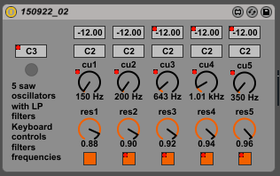

# 5 Saw Oscillators
### Ableton Live sound design instrument  

* * *

This an Max4Live instrument for Ableton Live.  
It has 5 saw oscillators with low pass filters and use keyboard controls filters frequencies.  
  
I have created this for my own sound design experiments.

A demo mp3 file is included. The demo use the instruments together with  automation. Drums sounds are added on top.

----
    
  
[More sound experiments](https://anderspedersen.bandcamp.com/album/algorithms-field-recordings-and-synth-programming)
